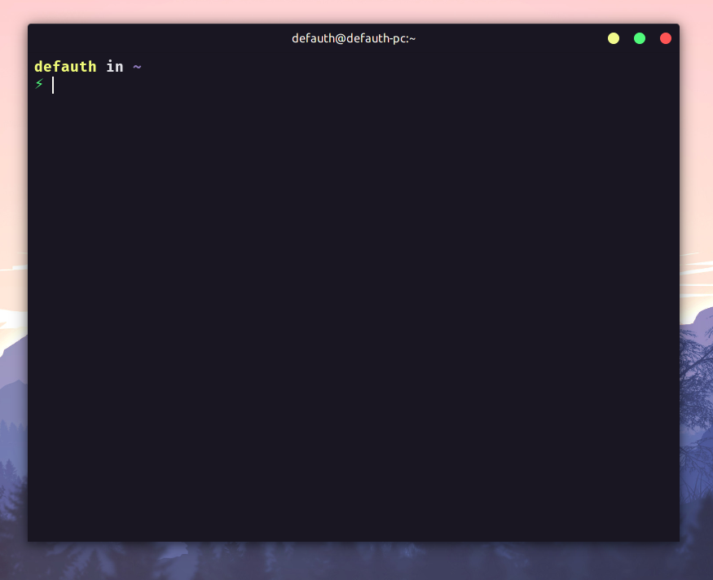
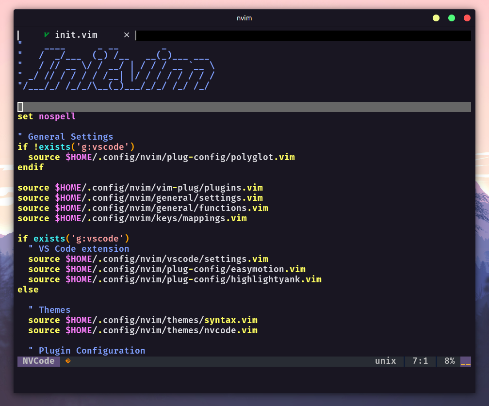

## Meu sistema operacional

Linux: Manjaro (Gnome)
Kernel: 20.2.1

### Configuração do alacritty (Emulador do terminal)



---

### Configuração do neovim



#### 1 - Alacritty Terminal

> Esses comandos abaixos servem para distro baseadas no arch linux.

```sh
# Instale o Alacritty
sudo pacman -S alacritty

# Instale a fonte
yay -S ttf-jetbrains-mono

# Crie o diretório de configuração do alacritty
mkdir $HOME/.config/alacritty

# Copie o arquivo de configuração
cp files/alacritty.yml $HOME/.config/alacritty/alacritty.yml
```

#### 2 - Zshell

```sh
# Verifique se o Zshell está instalado
zsh --version

# Instale o Oh My Zshell
sh -c "$(curl -fsSL https://raw.githubusercontent.com/robbyrussell/oh-my-zsh/master/tools/install.sh)"

# Instale o tema spaceship
git clone https://github.com/denysdovhan/spaceship-prompt.git "$ZSH_CUSTOM/themes/spaceship-prompt"

# Crie um link simbólico para o tema
ln -s "$ZSH_CUSTOM/themes/spaceship-prompt/spaceship.zsh-theme" "$ZSH_CUSTOM/themes/spaceship.zsh-theme"

# Copie os arquivos de configuração do Zshell
cp files/zshrc $HOME/.zshrc
```

#### 3 - VIM

> As configuraçoes do neovim estão na pasta files/neovim

```sh
# Instale o vundle
git clone https://github.com/VundleVim/Vundle.vim.git ~/.vim/bundle/Vundle.vim

# Copie os arquivos de configuração do vim
cp files/vimrc $HOME/.vimrc

# Inicie o vim
vim

# Instale os plugins
:PluginInstall
```

#### 4 - VS code

```sh
# Instale o code
yay -S visual-studio-code-bin
```

Instale a extensão settings sync e faça o login com o github

#### 5 - Git

```sh
# Va para o diretório do dotfiles
cd code/github/dotfiles

# Copie o arquivo de configuração para a sua home
cp files/gitconfig $HOME/.gitconfig

# Crie uma nova chave ssh
ssh-keygen -t rsa -b 4096 -C "neto.daniribeiro@gmail.com"

# Deixe rodando em background
eval "$(ssh-agent -s)"

#Adicione a sua lista de ssh keys
ssh-add ~/.ssh/id_rsa

# Instale o github cli
yay -S github-cli

# Mude o tipo de protocolo
gh config set git_protocol ssh
```

Adicione a key na sua conta do github

#### 6 - Tmux

```sh
# Instale o tmux
sudo pacman -S tmux

# Instale o tmux plugin manager
git clone https://github.com/tmux-plugins/tpm ~/.tmux/plugins/tpm

# Copie os arquivos de configução
cp files/tmux.conf $HOME/.tmux.conf

# Entre no tmux
tmux

# Instale os plugins
prefix (CRTL + A) + I (shift + i)
```

#### Linux Apps

```sh
# Todos os programas
yay -S libreoffice-fresh gimp inkscape thunar vlc insomnia

# Libreoffice (Suite Office)
yay -S libreoffice-fresh

# Gimp (Editor de imagens)
yay -S gimp

# Inkscape (Editor de vetores)
yay -S inkscape

# Explorador de arquivos
yay -S thunar

# Reprodutor de videos e músicas
yay -S vlc

# Testador de API
yay -S insomnia
```

#### Windows 10 Apps

- [Google Chrome](https://www.google.com/intl/pt-BR/chrome/) (Navegador)
- [Brave](https://brave.com/download/) (Navegador)
- [Firefox](https://www.mozilla.org/pt-BR/firefox/new/) (Navegador)
- [Visual Studio Code](https://code.visualstudio.com/) (Editor de código)
- [Windows Terminal](https://github.com/microsoft/terminal) (Emulador de terminal)
- [Discord](https://discord.com/) (App de mensagem)
- [Winrar](https://www.win-rar.com/start.html?&L=0) (Compactador de arquivos)
- [KeePassXC](https://keepassxc.org/download/#windows) (Gerenciador de senhas)
- [Inkscape](https://inkscape.org/release/inkscape-1.0.1/) (Editor de vetores)
- [Gimp](https://www.gimp.org/downloads/) (Editor de imagens)
- [Kdenlive](https://kdenlive.org/en/download/) (Editor de vídeo)
- [Steam](https://store.steampowered.com/about/) (Plataforma para baixar jogos)
- [NetBeans](https://www.oracle.com/technetwork/pt/java/javase/downloads/jdk-netbeans-jsp-3413153-ptb.html) (IDE de desenvolvimento)
- [QbitTorrent](https://www.qbittorrent.org/download.php) (Software para baixar torrents)
- [Libreoffice](https://www.libreoffice.org/download/download/) (Suite office)
